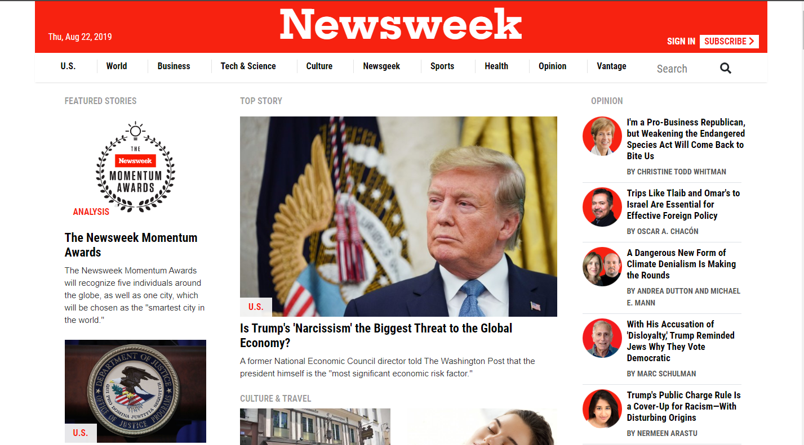

# Using Bootstrap

> this project consist on build a replica of the news site [Newsweek.com](https://www.newsweek.com/) using the Bootstrap framework.

You can find the original specification for this project here: [The Odin Project](https://www.theodinproject.com/courses/html5-and-css3/lessons/using-bootstrap)

## Built With

- HTML, CSS3
- Bootstrap v4.4.1

## Live Demo

[Live Demo Link](https://raw.githack.com/oscardelalanza/newsweek/master/index.html)

## Getting Started

### Prerequisites

- `git`

### Setup

To clone the project into your local environment do the following

- open a new `terminal` window and navigate to the directory where the project will be stored
- run the command `git clone git@github.com:oscardelalanza/newsweek.git`
- run the command `cd newsweek` to enter to the project directory

### Usage

To start the local development server do the following

- open the file `index.html` in your web browser 

### Run tests

- no written tests yet

## Authors

👤 **Oscar De La Lanza**

- Github: [@oscardelalanza](https://github.com/oscardelalanza)
- Twitter: [@oscardelalanza](https://twitter.com/oscardelalanza)
- Linkedin: [Oscar De La Lanza](https://linkedin.com/in/oscardelalanza)
- Email: oscardelalanza@gmail.com

## 🤝 Contributing

Contributions, issues and feature requests are welcome!

## Show your support

Give a ⭐️ if you like this project!
